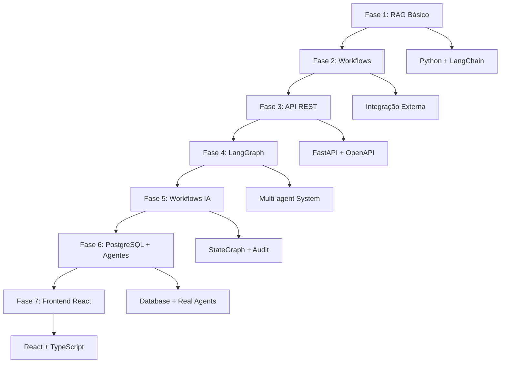

# 📚 Índice de Documentação - Sistema de Auditoria Fiscal ICMS

## 📋 Ordem Cronológica dos Documentos

### **Fase Inicial - Planejamento e Estruturação**
- **01** `01_plano_inicial.md` - Plano inicial do projeto e objetivos gerais
- **02** `02_fase_01_implementacao.md` - Implementação da Fase 1 (Sistema RAG)
- **03** `03_documentacao_inicial.md` - Primeira versão da documentação técnica
- **04** `04_documentacao_enhanced.md` - Documentação aprimorada com melhorias
- **05** `05_documentacao_enhanced_v2.md` - Segunda versão enhanced

### **Fase de Refinamento e Desenvolvimento**
- **06** `06_plano_refinado.md` - Plano refinado do projeto com ajustes
- **07** `07_fases_02_03_implementacao.md` - Implementação das Fases 2 & 3
- **08** `08_relatorio_final_fase_02.md` - Relatório final da Fase 2
- **09** `09_relatorio_integracao_abc_farma.md` - Integração ABC Farma/NESH
- **10** `10_regras_gerais_complementares.md` - Regras NESH complementares

### **Fase de Consolidação**
- **11** `11_fases_03_04_implementacao.md` - Desenvolvimento das Fases 3 & 4
- **12** `12_relatorio_final_fases_03_04.md` - Relatório final das Fases 3 & 4
- **13** `13_consideracoes_gerais.md` - Considerações e diretrizes gerais
- **14** `14_relatorio_implementacao_completa.md` - Relatório de implementação v21
- **15** `15_relatorio_organizacao_projeto.md` - Organização do projeto

### **Fase Final - Sistema Completo**
- **16** `16_relatorio_fase_06_sistema_integrado.md` - Sistema integrado com PostgreSQL
- **17** `17_relatorio_fase_07_frontend_react.md` - **Frontend React completo** ⭐

---

## 🎯 Resumo por Fases

### **Fase 1** (Documentos 01-03)
- **Objetivo**: Implementar sistema RAG básico
- **Resultado**: Sistema com >90% de acurácia em classificação NCM/CEST
- **Tecnologias**: Python, LangChain, ChromaDB

### **Fase 2** (Documentos 04-08)
- **Objetivo**: Criar workflows e integração externa
- **Resultado**: Integração com dados ABC Farma e NESH
- **Tecnologias**: Workflows Python, APIs externas

### **Fase 3** (Documentos 09-10)
- **Objetivo**: Desenvolver API REST
- **Resultado**: 8 endpoints funcionais com FastAPI
- **Tecnologias**: FastAPI, OpenAPI, Swagger

### **Fase 4** (Documentos 11-12)
- **Objetivo**: Implementar infraestrutura LangGraph
- **Resultado**: Workflows inteligentes com IA
- **Tecnologias**: LangGraph, StateGraph, Multi-agent

### **Fase 5** (Documentos 13-14)
- **Objetivo**: Consolidar workflows funcionais
- **Resultado**: Sistema de workflows 100% operacional
- **Tecnologias**: LangGraph StateGraph, Audit Trail

### **Fase 6** (Documentos 15-16)
- **Objetivo**: Integrar sistema completo com PostgreSQL
- **Resultado**: Sistema robusto com agentes reais
- **Tecnologias**: PostgreSQL, Agentes IA, Sistema Integrado

### **Fase 7** (Documento 17)
- **Objetivo**: Criar frontend React moderno
- **Resultado**: Interface completa full-stack
- **Tecnologias**: React 18, TypeScript, Material-UI

---

## 📊 Evolução Tecnológica

---

## 🎉 Status Final

**✅ SISTEMA COMPLETO IMPLEMENTADO**

- **Backend**: Python + FastAPI + PostgreSQL + LangGraph
- **Frontend**: React + TypeScript + Material-UI
- **IA**: Agentes inteligentes para classificação NCM/CEST
- **Infraestrutura**: Docker + PostgreSQL + Sistema de Auditoria
- **Interface**: Dashboard executivo + CRUD completo + Relatórios

**O projeto evoluiu de um sistema RAG básico para uma solução full-stack profissional de auditoria fiscal ICMS.**
