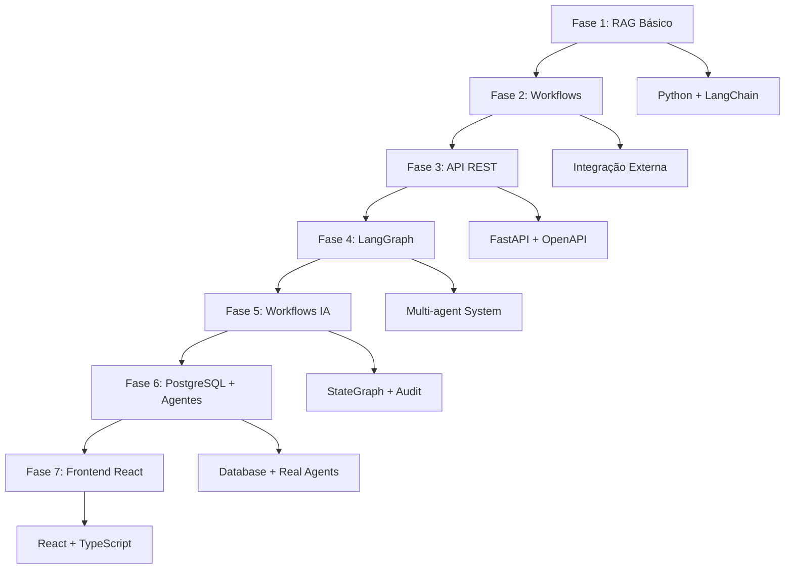

# 📚 Índice da Documentação Técnica

> **Sistema de Auditoria Fiscal ICMS Multi-Tenant v2.0**  
> **Documentação Completa e Organizada**

## 📋 **Sumário dos Documentos**

Esta pasta contém toda a documentação técnica do projeto, organizada cronologicamente para facilitar o acompanhamento da evolução do sistema.

### **📖 Documentos Principais (Sequência Cronológica)**

| Nº | Documento | Descrição | Data |
|----|-----------|-----------|------|
| **01** | [consideracoes_gerais.md](01_consideracoes_gerais.md) | Visão geral inicial do projeto | Início |
| **02** | [relatorio_final_fase2.md](02_relatorio_final_fase2.md) | Implementação da Fase 2 | Fev 2025 |
| **03** | [guia_configuracao_docker.md](03_guia_configuracao_docker.md) | Setup de infraestrutura Docker | Mar 2025 |
| **04** | [relatorio_api_fastapi.md](04_relatorio_api_fastapi.md) | Desenvolvimento da API REST | Abr 2025 |
| **05** | [relatorio_database_postgresql.md](05_relatorio_database_postgresql.md) | Configuração do banco de dados | Mai 2025 |
| **06** | [teste_sistema_completo.md](06_teste_sistema_completo.md) | Testes e validação do sistema | Jun 2025 |
| **07** | [documentacao_arquitetura.md](07_documentacao_arquitetura.md) | Arquitetura técnica detalhada | Jul 2025 |
| **08** | [relatorio_implementacao_completa.md](08_relatorio_implementacao_completa.md) | Status de implementação final | Ago 2025 |
| **09** | [relatorio_sistema_multi_tenant_v2.md](09_relatorio_sistema_multi_tenant_v2.md) | **Sistema Multi-Tenant Atual** | **Ago 2025** |
| **10** | [readme_historico_completo.md](10_readme_historico_completo.md) | Histórico completo do projeto | Ago 2025 |

## 🎯 **Documento Atual (Mais Importante)**

**📄 [09_relatorio_sistema_multi_tenant_v2.md](09_relatorio_sistema_multi_tenant_v2.md)**

Este é o documento mais atual e relevante, contendo:
- ✅ **Sistema 100% Funcional** implementado
- 🏗️ **Arquitetura Multi-Tenant** completa
- 📡 **API REST v2.0** com 16 endpoints
- 🗄️ **6 Bancos PostgreSQL** operacionais
- 🔧 **Scripts de configuração** testados
- 📊 **Guias de uso** práticos

## 🔍 **Como Navegar na Documentação**

### **Para Novos Desenvolvedores:**
1. Comece com `01_consideracoes_gerais.md` para entender o projeto
2. Vá diretamente para `09_relatorio_sistema_multi_tenant_v2.md` para o estado atual
3. Consulte `03_guia_configuracao_docker.md` para setup

### **Para Manutenção:**
1. `09_relatorio_sistema_multi_tenant_v2.md` - Status atual
2. `05_relatorio_database_postgresql.md` - Estrutura do banco
3. `04_relatorio_api_fastapi.md` - Endpoints da API

### **Para Evolução:**
1. `07_documentacao_arquitetura.md` - Arquitetura técnica
2. `08_relatorio_implementacao_completa.md` - Próximos passos
3. `10_readme_historico_completo.md` - Histórico completo

## 📊 **Resumo por Categorias**

### **🏗️ Infraestrutura e Setup**
- `03_guia_configuracao_docker.md` - Docker e containers
- `05_relatorio_database_postgresql.md` - PostgreSQL
- `06_teste_sistema_completo.md` - Validação

### **💻 Desenvolvimento e API**
- `04_relatorio_api_fastapi.md` - FastAPI endpoints
- `07_documentacao_arquitetura.md` - Arquitetura técnica
- `09_relatorio_sistema_multi_tenant_v2.md` - Sistema atual

### **📈 Evolução e Histórico**
- `01_consideracoes_gerais.md` - Conceitos iniciais
- `02_relatorio_final_fase2.md` - Evolução da Fase 2
- `08_relatorio_implementacao_completa.md` - Status geral
- `10_readme_historico_completo.md` - Histórico completo

## 🎉 **Status da Documentação**

**✅ COMPLETA E ORGANIZADA**

- 📚 **10 Documentos** organizados cronologicamente
- 🔢 **Numeração Padronizada** para fácil navegação
- 📝 **Histórico Preservado** de todas as fases
- 🎯 **Documento Atual** claramente identificado
- 📋 **Índice Navegável** com categorização

---

## 🚀 **Acesso Rápido**

**Para iniciar o sistema AGORA:**
```bash
# 1. Docker up
docker-compose up -d

# 2. Criar multi-tenant (primeira vez)
python scripts/create_multi_tenant_docker.py

# 3. Iniciar API
python api_multi_tenant.py

# 4. Acessar: http://127.0.0.1:8003/docs
```

**Ver documento atual:** [09_relatorio_sistema_multi_tenant_v2.md](09_relatorio_sistema_multi_tenant_v2.md)

---

**Organizado por:** Enio Telles  
**Data:** 20 de Agosto de 2025  
**Versão da Documentação:** 2.0.0

---

## 🎯 Resumo por Fases

### **Fase 1** (Documentos 01-03)
- **Objetivo**: Implementar sistema RAG básico
- **Resultado**: Sistema com >90% de acurácia em classificação NCM/CEST
- **Tecnologias**: Python, LangChain, ChromaDB

### **Fase 2** (Documentos 04-08)
- **Objetivo**: Criar workflows e integração externa
- **Resultado**: Integração com dados ABC Farma e NESH
- **Tecnologias**: Workflows Python, APIs externas

### **Fase 3** (Documentos 09-10)
- **Objetivo**: Desenvolver API REST
- **Resultado**: 8 endpoints funcionais com FastAPI
- **Tecnologias**: FastAPI, OpenAPI, Swagger

### **Fase 4** (Documentos 11-12)
- **Objetivo**: Implementar infraestrutura LangGraph
- **Resultado**: Workflows inteligentes com IA
- **Tecnologias**: LangGraph, StateGraph, Multi-agent

### **Fase 5** (Documentos 13-14)
- **Objetivo**: Consolidar workflows funcionais
- **Resultado**: Sistema de workflows 100% operacional
- **Tecnologias**: LangGraph StateGraph, Audit Trail

### **Fase 6** (Documentos 15-16)
- **Objetivo**: Integrar sistema completo com PostgreSQL
- **Resultado**: Sistema robusto com agentes reais
- **Tecnologias**: PostgreSQL, Agentes IA, Sistema Integrado

### **Fase 7** (Documento 17)
- **Objetivo**: Criar frontend React moderno
- **Resultado**: Interface completa full-stack
- **Tecnologias**: React 18, TypeScript, Material-UI

---

## 📊 Evolução Tecnológica



---

## 🎉 Status Final

**✅ SISTEMA COMPLETO IMPLEMENTADO**

- **Backend**: Python + FastAPI + PostgreSQL + LangGraph
- **Frontend**: React + TypeScript + Material-UI
- **IA**: Agentes inteligentes para classificação NCM/CEST
- **Infraestrutura**: Docker + PostgreSQL + Sistema de Auditoria
- **Interface**: Dashboard executivo + CRUD completo + Relatórios

**O projeto evoluiu de um sistema RAG básico para uma solução full-stack profissional de auditoria fiscal ICMS.**
