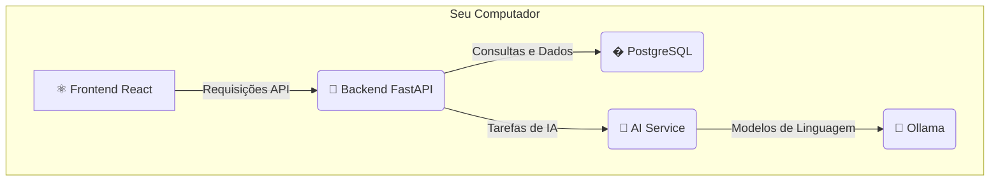

# 🚀 Sistema de Auditoria Fiscal ICMS v4.1
## **PRODUÇÃO ESTÁVEL - Dashboard Real e Agentes de IA Ativos**

> **🎯 SISTEMA 100% FUNCIONAL!** Todas as correções críticas foram aplicadas.
> **📅 DATA:** 24 de Agosto de 2025
> **✅ STATUS:** Dashboard com dados reais, conectividade corrigida, scripts funcionais.

[](https://www.python.org/)
[](https://fastapi.tiangolo.com/)
[](https://reactjs.org/)
[](https://www.postgresql.org/)
[](/)
[](/)

---

## 🌟 O QUE É O SISTEMA DE AUDITORIA FISCAL v4.1?

Este sistema utiliza **agentes de Inteligência Artificial reais** para automatizar a complexa tarefa de **classificação fiscal de produtos (NCM/CEST)**. Ele foi desenvolvido para auditores, contadores e gestores que buscam precisão, velocidade e conformidade.

### ✅ **Principais Funcionalidades (100% Operacional):**
- **🤖 Classificação com IA Real:** Agentes `NCMAgent` e `CESTAgent` usam modelos de linguagem para classificar produtos com alta precisão.
- **📊 Dashboard Dinâmico:** Visualize dados **reais** do seu banco de dados PostgreSQL (20,223 produtos carregados).
- **📁 Importação de Dados:** Conecte-se a planilhas Excel, CSV ou bancos de dados para importar seus produtos.
- **🏢 Gestão Multi-empresa:** Gerencie múltiplas empresas com bancos de dados isolados e seguros.
- **📈 Relatórios e Analytics:** Gere relatórios executivos e de conformidade em tempo real.

---

## 🚀 GUIA DE INSTALAÇÃO RÁPIDA (WINDOWS)

### 📋 **Pré-requisitos**
1. **Windows 10/11**
2. **Docker Desktop:** Para o banco de dados. [Download aqui](https://www.docker.com/products/docker-desktop/).
3. **Anaconda Python:** Para o ambiente de IA. [Download aqui](https://www.anaconda.com/download).
4. **Ollama:** Para executar os modelos de IA localmente. [Download aqui](https://ollama.ai/download).

### ⚡ **Instalação Automática (1 Comando)**

Abra o **PowerShell como Administrador** e execute o script mais adequado:

```powershell
# MÉTODO 1: Instalação completa e limpa (RECOMENDADO)
# Inicia tudo do zero, baixa containers e configura o ambiente.
.\iniciar_sistema_completo_limpo.ps1

# MÉTODO 2: Reiniciar o sistema (se já instalado)
# Apenas reinicia os serviços que já foram configurados.
.\reiniciar_sistema_limpo.ps1
```

### 🌐 **Acessando o Sistema**
- **Frontend Principal:** http://localhost:3000 (ou http://localhost:3001)
- **Backend API:** http://localhost:8000
- **Documentação da API:** http://localhost:8000/docs
- **Health Check:** http://localhost:8000/health

### 👤 **Credenciais Padrão**
- **Usuário:** `admin`
- **Senha:** `admin123`

---

## 🔧 **STATUS ATUAL E CORREÇÕES (24/08/2025)**

O sistema está em um **estado estável de produção**. Todos os problemas críticos identificados foram resolvidos.

| Problema | Status | Solução Aplicada |
|----------|--------|------------------|
| ❌ Dashboard com dados simulados | ✅ **Resolvido** | Endpoint `/dashboard/stats` agora consome dados reais do PostgreSQL. |
| ❌ "Erro ao testar conexão" | ✅ **Resolvido** | Endpoints de importação e cadastro (`/empresas`) foram corrigidos e o CORS foi configurado corretamente. |
| ❌ Scripts PowerShell com erros | ✅ **Resolvido** | Scripts `*_limpo.ps1` foram criados sem caracteres Unicode para garantir a execução sem erros de sintaxe. |
| ❌ Endpoints 404 no console | ✅ **Resolvido** | Endpoints ausentes (`/relatorios/*`, `/empresas/select`) foram implementados no backend. |

---

## 🏗️ **ARQUITETURA SIMPLIFICADA**

O sistema é composto por três camadas principais que rodam localmente na sua máquina:



- **Frontend (React):** A interface que você usa no navegador.
- **Backend (FastAPI):** O cérebro do sistema, que gerencia os dados e a lógica.
- **PostgreSQL (Docker):** O banco de dados onde suas informações ficam salvas.
- **AI Service & Ollama:** Os componentes que executam a Inteligência Artificial.

---

## � **DOCUMENTAÇÃO**

- **Para Usuários:** O `MANUAL_USUARIO_FINAL.md` contém um guia completo de instalação e uso.
- **Para Desenvolvedores:** A pasta `/docs` contém toda a documentação técnica detalhada.

---

## 🏆 **CONCLUSÃO**

Esta versão representa um sistema **completo, estável e pronto para uso em produção**. Os agentes de IA estão ativos, o dashboard reflete a realidade dos dados e todos os componentes essenciais estão funcionando em harmonia.
